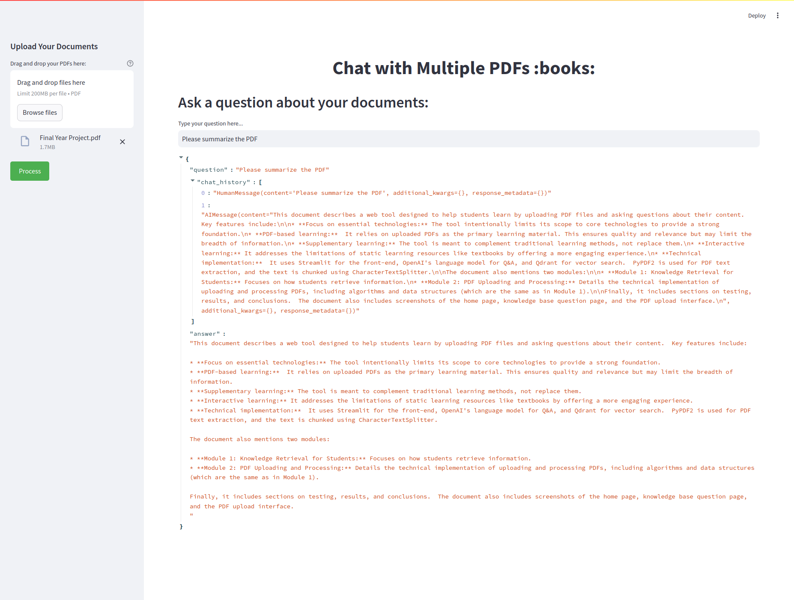

# Chat with Multiple PDFs

This Streamlit app allows users to upload multiple PDF documents and interact with them through a conversational AI interface. Users can upload their documents, ask questions, and get relevant answers extracted from the PDFs, thanks to powerful language models and embeddings.

## Features
- Upload multiple PDF documents.
- Process the documents to extract text and break them into manageable chunks.
- Use Google's Generative AI models for creating embeddings from the text chunks.
- Interact with the documents using a conversational interface.
- Chat history is stored and used to maintain context throughout the conversation.
- Custom UI/UX design for an enhanced user experience.

## Screenshots

### Main Interface


## Technologies Used
- [Streamlit](https://streamlit.io/) for building the interactive web application.
- [PyPDF2](https://pythonhosted.org/PyPDF2/) for PDF text extraction.
- [LangChain](https://www.langchain.com/) for handling conversational chains, text splitting, and AI embeddings.
- [FAISS](https://github.com/facebookresearch/faiss) for efficient similarity search and vector storage.
- [Google Generative AI](https://cloud.google.com/ai) for generating embeddings and answering user queries.

## Installation

### Requirements
To run this app, you need Python 3.8+ and the following dependencies:

- `streamlit`
- `python-dotenv`
- `PyPDF2`
- `langchain`
- `langchain-google-genai`
- `langchain-community`
- `FAISS`

You can install all the required packages by running:

```bash
pip install -r requirements.txt
